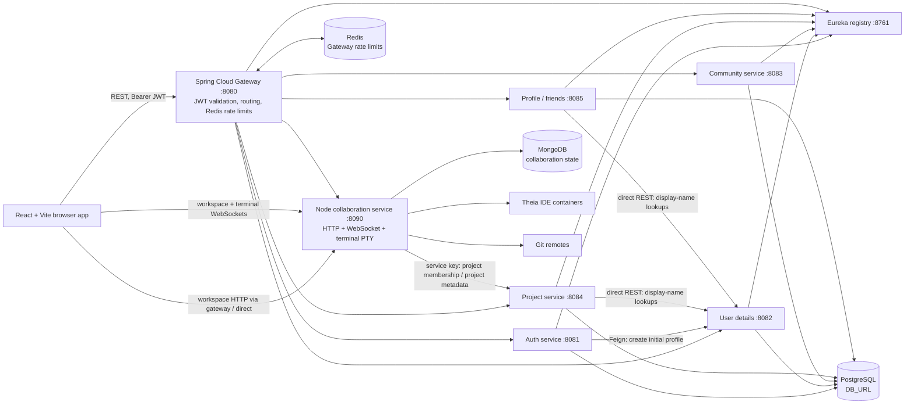
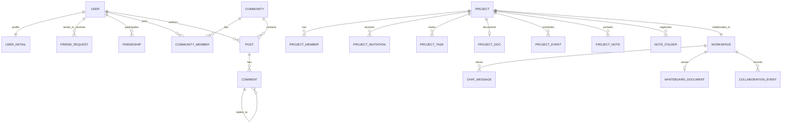

# Colaby: Architecture and API Reference

This document describes the implementation currently present in this repository. It is based on the application source, gateway configuration, and service configuration. It does not treat planned or implied behavior as implemented behavior.

## 1. Product outline

Colaby is a collaboration application with authenticated user profiles and friendships, communities with posts and threaded comments, project management, and real-time project workspaces. The browser application is a React single-page app. Most JSON APIs are routed through a Spring Cloud Gateway. Workspace APIs and live collaboration are served by a separate Node.js service.

## 2. System architecture



### Runtime components

| Component | Implementation | Default address | Responsibility |
|---|---|---:|---|
| Frontend | React 19, React Router, Vite | `http://localhost:3000` | Login/session handling and application screens |
| API gateway | Spring Cloud Gateway (WebFlux) | `http://localhost:8080` | Routes API traffic, validates bearer JWTs, derives user identity, applies Redis request limits and CORS |
| Discovery | Eureka server | `http://localhost:8761` | Service registry used by gateway load-balanced `lb://...` routes and Spring services |
| Auth service | Spring MVC, Spring Security, JPA | `http://localhost:8081` | Signup, login, access JWT and refresh-token lifecycle |
| User details service | Spring MVC, JPA | `http://localhost:8082` | Profile detail records keyed by auth user UUID |
| Community service | Spring MVC, JPA | `http://localhost:8083` | Communities, membership, posts, comments, votes |
| Project service | Spring MVC, JPA | `http://localhost:8084` | Projects, members, invitations, tasks, docs, events, notes and folders |
| Profile service | Spring MVC, JPA | `http://localhost:8085` | Friend requests and accepted friendships |
| Collaboration service | Express, Mongoose, `ws`, Yjs, `node-pty` | `http://localhost:8090` | Project workspace files, chat, whiteboard, realtime events, code sync, terminals, and Theia lifecycle |

The Spring services declare `server.address=127.0.0.1` in their default properties. The Node service listens on its configured `PORT` (default 8090). The collaboration service is not Eureka registered: the gateway forwards `/collaboration/**` to `http://localhost:8090` directly.

## 3. Request, identity and access flow

1. The frontend stores `accessToken` and `refreshToken` in browser local storage. Its shared Axios client adds `Authorization: Bearer <accessToken>` to JSON API requests and attempts token refresh after an authorization failure. Collaboration's direct Axios client also adds the access token.
2. Gateway `/auth/**` requests are exempt from its JWT global filter. Other routed requests require a valid signed JWT whose subject parses as a UUID.
3. The gateway removes any client-provided `X-User-Id` and `X-UserId`, then sets `X-User-Id` from the verified token subject. Spring business controllers use that header as the caller identity; clients should not set it themselves.
4. The Node collaboration service independently verifies the bearer JWT. Workspace HTTP routes additionally check that the authenticated user is a project member by calling the Project Service internal API with `X-Service-Key`.
5. Workspace WebSocket upgrades verify the JWT and project membership before accepting the socket. A connection is put into a room keyed by project ID. The terminal PTY uses a separate project-scoped token and also checks membership.

The gateway's Spring Security chain permits exchanges at its Spring Security layer; the custom global JWT filter is the actual gateway authentication check. The auth service has a JWT filter but authorizes all requests at its Spring Security rules. Service deployment boundaries should therefore be controlled so that internal service ports are not treated as public API entry points.

### Gateway route and rate-limit map

All gateway routes use Redis `RequestRateLimiter`. Current configured values are token replenish rate and burst capacity per resolved key.

| Gateway path | Destination | Rate | Key |
|---|---|---:|---|
| `/auth/**` | `lb://AUTHSERVICE` | 10 / 20 | Client IP |
| `/users/details`, `/users/details/**`, `/users/allprofiles` | `lb://USERDETAILSSERVICE` | 10 / 20 | `X-User-Id`, otherwise IP |
| `/profiles/**` | `lb://PROFILESERVICE` | 10 / 20 | `X-User-Id`, otherwise IP |
| `/communities/**` | `lb://COMMUNITYSERVICE` | 10 / 20 | `X-User-Id`, otherwise IP |
| `/posts/**` | `lb://COMMUNITYSERVICE` | 10 / 20 | `X-User-Id`, otherwise IP |
| `/comments/**` | `lb://COMMUNITYSERVICE` | 10 / 20 | `X-User-Id`, otherwise IP |
| `/votes/**` | `lb://COMMUNITYSERVICE` | 20 / 40 | `X-User-Id`, otherwise IP |
| `/projects/**` | `lb://PROJECTSERVICE` | 10 / 20 | `X-User-Id`, otherwise IP |
| `/collaboration/**` | `http://localhost:8090` | 20 / 40 | `X-User-Id`, otherwise IP |

The rate limits are configured on gateway route definitions and use a resolver that reads `X-User-Id`, falling back to client IP when that header is absent. The JWT filter removes client-supplied identity headers and writes the token subject as `X-User-Id`; its configured order is `-1` and its source comment says it runs after rate limiting, so treat the resolver's exact key on an individual request as dependent on Gateway filter ordering. These limits require the configured Redis instance. The default gateway CORS origins are `http://localhost:3000` and `http://localhost:5173`; allowed methods are GET, POST, PUT, DELETE, PATCH and OPTIONS, with credentials enabled.

## 4. Frontend application map

`frontend/src/App.jsx` defines the browser routes. `/login` and `/signup` are public; all other application routes are inside `ProtectedRoute`.

| Browser route | Screen / purpose |
|---|---|
| `/login`, `/signup` | Authentication |
| `/` | Redirects to `/explore` |
| `/explore` | Discover profiles / projects / communities |
| `/profile`, `/onboarding` | Current user's profile and onboarding |
| `/users/:id` | Other user's profile |
| `/community` | Community listing |
| `/community/:communityId` | Community detail and posts |
| `/community/:communityId/posts/:postId` | Post and comments |
| `/projects` | Project listing and creation |
| `/projects/:projectId` | Project details, members, tasks, events, notes, invitations and docs |
| `/workspace/:projectId` | Collaborative workspace UI |
| `/friends` | Friendship and friend-request UI |

Unknown browser routes redirect to `/explore`. The main HTTP API base defaults to `http://localhost:8080` (`VITE_API_BASE_URL`). Direct collaboration HTTP defaults to `http://localhost:8090` (`VITE_COLLAB_DIRECT_URL`). The frontend WebSocket hook currently uses a literal `ws://localhost:8090` URL.

## 5. REST API reference

Unless noted otherwise, endpoints in this section are called at the gateway base `http://localhost:8080` and require `Authorization: Bearer <accessToken>`. The gateway supplies `X-User-Id`. `{id}` path values are UUIDs unless otherwise stated. Successful JSON shapes are the controller DTO/entity responses; error formats vary by service.

### Authentication (`authservice`)

These endpoints do not require an access token. Signup/login requests are validated DTOs. Access and refresh tokens are returned in `AuthResponse`.

| Method | Path | Purpose |
|---|---|---|
| POST | `/auth/signup` | Create account and initial user-details record; body `SignupRequest` (email, password) |
| POST | `/auth/login` | Authenticate; body `LoginRequest` (email, password) |
| POST | `/auth/refresh` | Validate refresh token and issue a new access token; body `{ "refreshToken": "..." }` |
| POST | `/auth/logout` | Delete supplied refresh token; body `{ "refreshToken": "..." }` |

The refresh endpoint reuses the supplied refresh token in the response; it does not rotate it in the controller. Passwords are BCrypt encoded (configured strength 8). Refresh tokens are persisted by the Auth Service.

### User details (`userdetailsservice`)

| Method | Path | Purpose / access |
|---|---|---|
| PUT | `/users/details` | Create/update the caller's profile data. The service overwrites body `userId` with gateway identity. |
| GET | `/users/details/{id}` | Fetch a user profile by auth UUID. |
| GET | `/users/allprofiles` | Return all profile records. |

### Friends (`profileservice`)

| Method | Path | Purpose / access |
|---|---|---|
| POST | `/profiles/friends/request/{receiverId}` | Send a friend request; 201 response |
| PUT | `/profiles/friends/request/{requestId}/accept` | Accept an incoming request |
| PUT | `/profiles/friends/request/{requestId}/reject` | Reject an incoming request |
| GET | `/profiles/friends/requests/incoming` | Current user's pending incoming requests |
| GET | `/profiles/friends/requests/sent` | Current user's pending outgoing requests |
| GET | `/profiles/friends` | Accepted friends of current user |

### Communities, posts, comments and votes (`communityservice`)

All operations below require an authenticated user; membership and author rules are enforced in service logic.

| Method | Path | Purpose / access |
|---|---|---|
| POST | `/communities` | Create a community; body `CreateCommunityRequest`; 201 |
| GET | `/communities` | List communities for caller |
| GET | `/communities/{communityId}` | Get community |
| POST | `/communities/{communityId}/join` | Join community |
| DELETE | `/communities/{communityId}/leave` | Leave community; 204 |
| GET | `/communities/{communityId}/posts` | List community posts |
| POST | `/posts/communities/{communityId}` | Create post; body `CreatePostRequest`; 201 |
| GET | `/posts/{postId}` | Get post |
| DELETE | `/posts/{postId}` | Delete own post; 204 |
| GET | `/posts/my` | List caller's posts |
| POST | `/comments/posts/{postId}` | Create comment/reply; body `CreateCommentRequest`; 201 |
| GET | `/comments/posts/{postId}` | Read threaded comments |
| DELETE | `/comments/{commentId}` | Delete own comment; 204 |
| POST | `/votes/posts/{postId}` | Up/down vote a post; body `{ "voteType": "UP"|"DOWN" }`; returns counts |
| POST | `/votes/comments/{commentId}` | Up/down vote a comment; same body and count response |

Submitting the same vote type toggles/removes it. The concrete post/comment response fields are defined by `PostResponse` and `CommentResponse` DTOs.

### Projects and collaboration metadata (`projectservice`)

| Method | Path | Purpose / access |
|---|---|---|
| POST | `/projects` | Create a project; caller is creator/member; body `CreateProjectRequest`; 201 |
| GET | `/projects` | List projects with membership metadata |
| GET | `/projects/my` | List projects where caller is a member |
| GET | `/projects/{projectId}` | Read project |
| PUT | `/projects/{projectId}` | Update project; creator only |
| DELETE | `/projects/{projectId}` | Delete project; creator only; 204 |
| GET | `/projects/{projectId}/members` | List members; project member only |
| POST | `/projects/{projectId}/invitations/request` | Non-member requests to join; 201 |
| POST | `/projects/{projectId}/invitations/invite/{targetUserId}` | Creator invites a user; 201 |
| GET | `/projects/{projectId}/invitations` | Creator lists pending invitations for project |
| GET | `/projects/invitations/my` | Caller lists pending invitations sent to them |
| POST | `/projects/invitations/{invitationId}/accept` | Accept invite or approve join request, depending on invitation type |
| POST | `/projects/invitations/{invitationId}/decline` | Decline invite or join request, depending on invitation type |
| POST | `/projects/{projectId}/tasks` | Creator assigns task to project member; body `AssignTaskRequest`; 201 |
| GET | `/projects/{projectId}/tasks` | List project tasks; member only |
| GET | `/projects/{projectId}/tasks/my` | List caller's assigned tasks |
| PATCH | `/projects/{projectId}/tasks/{taskId}/progress` | Assignee updates progress; body `UpdateTaskProgressRequest` |
| PATCH | `/projects/{projectId}/tasks/{taskId}/status` | Assignee or creator changes status; body `UpdateTaskStatusRequest` |
| DELETE | `/projects/{projectId}/tasks/{taskId}` | Creator deletes task; 204 |
| PUT | `/projects/{projectId}/docs` | Creator creates/replaces project doc; body `UpsertDocRequest` |
| GET | `/projects/{projectId}/docs` | Project member reads project doc |
| POST | `/projects/{projectId}/events` | Creator creates event; body `CreateEventRequest`; 201 |
| GET | `/projects/{projectId}/events` | Read events visible to caller |
| DELETE | `/projects/{projectId}/events/{eventId}` | Creator deletes event; 204 |
| POST | `/projects/{projectId}/notes/folders` | Project member creates note folder; 201 |
| GET | `/projects/{projectId}/notes/folders` | List note folders |
| DELETE | `/projects/{projectId}/notes/folders/{folderId}` | Delete folder and its notes; 204 |
| POST | `/projects/{projectId}/notes` | Create note; 201 |
| GET | `/projects/{projectId}/notes` | List project notes |
| GET | `/projects/{projectId}/notes/{noteId}` | Read note |
| PUT | `/projects/{projectId}/notes/{noteId}` | Update note |
| DELETE | `/projects/{projectId}/notes/{noteId}` | Delete note; 204 |

Project docs and events have stricter creator/member rules than notes: any project member may read docs and notes and edit notes; only creators write docs or create/delete events. Event visibility can be `ALL` or restricted to selected participants, per event service behavior.

### Collaboration workspace HTTP (`collaboration-service`)

The service mounts the same workspace router at both `/collaboration/api/workspaces` and `/api/workspaces`. The first is exposed through the gateway; the second is direct-service access. In this table `<base>` means either of those path prefixes. Workspace routes require a valid bearer JWT plus membership in the project. The Node service responds with `{ success, data }` for most workspace operations.

| Method | Path | Purpose / payload notes |
|---|---|---|
| GET | `<base>/{projectId}` | Get/create workspace record and repository metadata |
| POST | `<base>/{projectId}/initialize` | Initialize an empty workspace if not already initialized |
| POST | `<base>/{projectId}/initialize/empty` | Alias for empty initialization |
| POST | `<base>/{projectId}/initialize/clone` | Clone project repository (body can include `token`, `repoUrl`) |
| POST | `<base>/{projectId}/clone` | Clone alias; frontend uses direct service for long clone requests |
| GET | `<base>/{projectId}/tree` | Read workspace file tree |
| GET | `<base>/{projectId}/file?path=...` | Read file contents |
| POST | `<base>/{projectId}/file` | Write file; body `{ path, content }` |
| POST | `<base>/{projectId}/files/operation` | Apply a filesystem/tree operation body |
| GET | `<base>/{projectId}/members` | Read project members via Project Service |
| GET | `<base>/{projectId}/chat?before=...&limit=...` | Read paginated chat history |
| POST | `<base>/{projectId}/chat` | Send chat message; body `{ content }` |
| GET | `<base>/{projectId}/whiteboard` | Read saved whiteboard state |
| DELETE | `<base>/{projectId}/whiteboard` | Clear whiteboard and broadcast clear event |
| POST | `<base>/{projectId}/theia/start` | Start Theia IDE for workspace |
| GET | `<base>/{projectId}/theia` | Get IDE state |
| POST | `<base>/{projectId}/theia/stop` | Stop IDE |
| POST | `<base>/{projectId}/terminal/exec` | Execute a command; body `{ command }` |
| GET | `<base>/{projectId}/terminal-token` | Issue a terminal-scoped JWT for PTY WebSocket connection |
| GET | `/health` | Node service health JSON; direct service path, not covered by gateway `/collaboration/**` route |

The frontend uses the gateway prefix for ordinary workspace operations (`/collaboration/api/workspaces/...`), calls direct port 8090 for clone and terminal command execution, and falls back to direct service for Theia/token operations on network, 401, or 5xx errors. The API gateway route forwards `/collaboration/**` to port 8090 without a configured prefix rewrite.

### Service-to-service endpoints (not browser APIs)

| Caller → service | Method/path | Authentication / role |
|---|---|---|
| Auth → User Details | POST `/users/internal/createUser` | Feign call; internal endpoint is not included in gateway route predicates |
| Collaboration → Project | GET `/projects/internal/{projectId}/members` | `X-Service-Key` shared secret; constant-time comparison in controller |
| Project/Profile → User Details | GET `/users/details/{id}` | Direct REST on `userdetailsservice.base-url`; used to enrich user-facing names |

The internal Project endpoint is on the Project Service port, not a gateway route. It returns `MemberResponse` rows for membership verification. The gateway configuration comment says `/users/internal/**` is excluded; in fact, the user-details gateway route only matches `/users/details`, `/users/details/**` and `/users/allprofiles`, so `/users/internal/createUser` is not routed through it.

## 6. WebSocket protocols

### Workspace collaboration socket

The frontend currently connects to `ws://localhost:8090/ws/workspace/{projectId}?token={accessToken}`. The Node upgrade handler accepts a project ID from the final URL path segment, so this path works even though the server does not check a fixed `/ws/workspace` prefix. Production deployments must provide a reachable `wss://` URL through corresponding frontend configuration/code.

Messages are JSON objects with a `type` string and optional `payload`. The server overwrites payload `userId` and `projectId` with authenticated connection values. On connection, server emits `CONNECTION_ACK` with online users and broadcasts `USER_JOINED`; on disconnect it may emit voice state and `USER_LEFT`. Heartbeats use `HEARTBEAT` and `HEARTBEAT_ACK`.

Implemented event families (`src/websocket/eventTypes.js`):

| Family | Events | Notes |
|---|---|---|
| Connection/presence | `CONNECTION_INIT`, `CONNECTION_ACK`, `CONNECTION_ERROR`, `PRESENCE_UPDATE`, `USER_JOINED`, `USER_LEFT`, `HEARTBEAT`, `HEARTBEAT_ACK`, `ERROR` | `CONNECTION_INIT`/presence event handling is subject to event router implementation; initial ACK and join/leave are server-emitted |
| Chat | `CHAT_MESSAGE`, `CHAT_HISTORY` | Chat messages persist through Chat Service and broadcast to the project room |
| Whiteboard | `WHITEBOARD_OBJECT_CREATE`, `WHITEBOARD_OBJECT_UPDATE`, `WHITEBOARD_OBJECT_DELETE`, `WHITEBOARD_CLEAR`, `WHITEBOARD_STATE_SYNC`, `WHITEBOARD_CURSOR_MOVE` | Mutations update saved whiteboard state; cursors are ephemeral |
| Filesystem | `FILE_CREATE`, `FILE_DELETE`, `FILE_RENAME`, `FILE_MOVE`, `FILE_SAVE`, `FOLDER_CREATE`, `FOLDER_DELETE`, `FOLDER_RENAME`, `FOLDER_MOVE`, `WORKSPACE_INITIALIZED`, `WORKSPACE_SYNC` | Tree operations run through filesystem manager / tree CRDT; selected operations are persisted as collaboration events |
| Code editing | `CODE_OPERATION`, `CODE_SYNC`, `CODE_CURSOR_MOVE`, `CODE_SELECTION_CHANGE` | Yjs-backed document sessions; cursor/selection broadcasts are ephemeral |
| Voice signaling | `JOIN_VOICE`, `LEAVE_VOICE`, `WEBRTC_OFFER`, `WEBRTC_ANSWER`, `WEBRTC_ICE_CANDIDATE`, `VOICE_STATE`, `VOICE_MUTE_STATE` | Signaling relays WebRTC negotiation; media is peer-to-peer rather than server audio transport |

The authoritative payload schemas and per-event validation are in `eventValidator.js`; message names alone do not guarantee that every declared event has a dedicated handler. `eventRouter.js` currently uses a placeholder rate limiter that always returns false, despite a separate rate limiter module existing in the service.

### Terminal PTY socket

The terminal WebSocket upgrades at `/terminal-pty` or a path beginning `/terminal/`. Pass `projectId` and the token returned by `GET .../terminal-token` as query parameters (the HTTP upgrade handler also accepts bearer auth). The token contains user and project scope, expires in 24 hours, and the server checks project membership. Client messages use `{ "type":"input", "data":"..." }` and `{ "type":"resize", "cols":120, "rows":30 }`; server sends `output` and `exit` messages. This is a host PTY rooted at the project's workspace directory.

## 7. Data architecture

### Relational data (Spring/JPA)

All Spring JPA services read `DB_URL`, `DB_USERNAME`, and `DB_PASSWORD` and use `spring.jpa.hibernate.ddl-auto=update`. The repository does not define a migration framework or explicit per-service database/schema names in the inspected properties; deployment configuration determines whether they share one PostgreSQL database. User identity references are UUID values passed between services; there is no cross-service JPA relationship.

| Service | Main persisted records |
|---|---|
| Auth | `User`, `RefreshToken` |
| User details | `UserDetail` (UUID aligned with auth user) |
| Community | `Community`, `CommunityMember`, `Post`, `Comment`, `Vote` |
| Profile | `FriendRequest`, `Friendship` |
| Project | `Project`, `ProjectMember`, `ProjectInvitation`, `ProjectTask`, `ProjectDoc`, `ProjectEvent`, `ProjectNote`, `NoteFolder` |

### Collaboration data and workspace files

The Node service connects to `MONGODB_URI`. Mongoose models include `Workspace`, `ChatMessage`, `WhiteboardDocument`, `CollaborationEvent`, `FileOperation`, `Snapshot`, and `CodeDocument`. Git workspace content lives on disk under `WORKSPACE_ROOT_DIR` (default resolves to `backend/collaboration-service/workspaces`), with workspace records holding paths/repository state. The service includes snapshot/replay and code-session logic, but do not assume all in-memory structures are durable: inspect the specific model/service path when changing persistence behavior.

### Principal relationships



The diagram captures conceptual relationships from IDs and service behavior. Most cross-service links are UUID values rather than database foreign keys.

## 8. Important workflows

### Signup and first profile

`POST /auth/signup` creates the auth user and then calls User Details through Eureka/Feign at `/users/internal/createUser`, passing the new UUID. After login, profile edits go through the gateway to `PUT /users/details`; the gateway identity header, not the submitted `userId`, determines ownership.

### Project workspace authorization

The browser enters `/workspace/{projectId}` after project selection. Workspace API and socket calls include the user's JWT. Collaboration validates the signature then asks Project Service whether the user is a member. The Node service calls Project Service's internal members endpoint with `X-Service-Key`; project access must succeed before files, chat, whiteboard, or the socket room are available.

### Live collaborative edits

Code changes are sent as `CODE_OPERATION` events. Collaboration keys sessions by `{projectId}:{filePath}`, applies Yjs updates, then broadcasts to other room sockets. File tree operations pass through a Tree CRDT manager; chat and whiteboard updates go through their services. Awareness events such as cursors are broadcast without database persistence.

## 9. Local development and configuration

### Required services and tools

- Java 21 and Maven wrappers for Spring services.
- Node.js and npm for frontend and collaboration service. `node-pty` requires its native dependency install/build support.
- PostgreSQL for Spring services, Redis for gateway request limiting, and MongoDB for collaboration service.
- Docker is used by Theia manager for IDE lifecycle; Git is required to clone repository workspaces.

### Configuration keys

| Variable / property | Used by | Meaning |
|---|---|---|
| `DB_URL`, `DB_USERNAME`, `DB_PASSWORD` | Spring data services | PostgreSQL connection |
| `SECRETKEY` | Gateway | HMAC JWT verification key; must match Auth Service signing key |
| Auth signing secret | Auth Service local/config properties | Signs access and refresh tokens; coordinate with gateway secret |
| `MONGODB_URI` | Collaboration | MongoDB connection; required |
| `JWT_SECRET` | Collaboration | JWT verification/signing; must be compatible with auth tokens |
| `PROJECT_SERVICE_KEY` | Project + Collaboration | Shared secret for internal membership lookup |
| `PROJECT_SERVICE_URL` | Collaboration | Direct Project Service URL (default example `http://localhost:8084`) |
| `userdetailsservice.base-url` | Project/Profile | Direct user details lookup URL (default `http://localhost:8082`) |
| `WORKSPACE_ROOT_DIR` | Collaboration | Root for cloned/initialized project workspaces |
| `PORT` | Collaboration | Node HTTP/WebSocket port; defaults to 8090 |
| `VITE_API_BASE_URL` | Frontend | Gateway URL; defaults to `http://localhost:8080` |
| `VITE_COLLAB_DIRECT_URL` | Frontend | Direct collaboration URL; defaults to `http://localhost:8090` |
| `VITE_WEBRTC_TURN_URLS`, `VITE_WEBRTC_TURN_USERNAME`, `VITE_WEBRTC_TURN_CREDENTIAL` | Frontend | Optional TURN relay configuration for WebRTC |

The `.env.example` files document only part of the configuration. `application-local.properties` is optional and is intentionally not present in the tracked source listing; create local secret-bearing configuration without committing credentials. Gateway Redis defaults to `localhost:6379`.

### Start commands

Run infrastructure first (PostgreSQL, Redis, MongoDB), provide local environment values, and then start each service. Example commands from the repository root:

```bash
# Eureka
cd backend/discoveryservice && ./mvnw spring-boot:run

# In separate terminals: start userdetailsservice, authservice, communityservice,
# projectservice, profileservice, and apigateway with their Maven wrappers.
cd backend/userdetailsservice && ./mvnw spring-boot:run

# Collaboration service
cd backend/collaboration-service && npm install && npm run dev

# Frontend
cd frontend && npm install && npm run dev
```

Run services in separate terminals; the multi-line snippet shows representative invocations, not a single shell session. Gateway routes expect Eureka registration for Spring services. Collaboration requires `MONGODB_URI`, `PROJECT_SERVICE_KEY`, and `JWT_SECRET` before startup.

## 10. Health, errors, and operational notes

- Gateway exposes Actuator `health` only and hides health details. Spring service actuator exposure also includes `health` where configured. Do not infer that every service has the same endpoint exposure without checking its properties.
- Collaboration has `GET /health`, returning service status and timestamp.
- Controller status codes explicitly include 201 for create operations and 204 for selected delete operations; other error bodies are service-specific. Community/Profile/Project have exception handlers; collaboration uses Express error middleware.
- Gateway auth failures return 401 JSON with an `error` string. Rate limiting depends on Redis. Spring route discovery depends on Eureka.
- Gateway response timeout defaults to 30 seconds, with longer overrides for Project (20 seconds) and collaboration (35 seconds); auth route is 30 seconds. Direct frontend requests bypass the gateway timeouts where used.
- The Node service uses CORS for configured Theia parent origins on direct requests; when proxied, it detects forwarded/user headers and avoids adding duplicate CORS headers.

## 11. Repository map

```text
frontend/                         React/Vite application and API clients
backend/apigateway/               Gateway routing, JWT filter, Redis limits, CORS
backend/discoveryservice/          Eureka registry
backend/authservice/               Authentication and refresh tokens
backend/userdetailsservice/        User profile details
backend/communityservice/          Community social graph/content
backend/profileservice/            Friend requests and friendships
backend/projectservice/             Projects and project planning modules
backend/collaboration-service/      Workspace HTTP, WebSockets, persistence, IDE/terminal
```

Within Spring services, the common shape is `controller → service → repository/entity`; DTOs are used for request/response boundaries. The collaboration service groups HTTP routes/controllers, domain services, Mongoose models, WebSocket transport/event routing, and collaboration algorithms under `src/`.

## 12. Known implementation boundaries to keep in mind

- The gateway's route list, rather than controller existence alone, determines what is reachable through port 8080. Internal routes must be called directly by trusted services.
- `GET /users/allprofiles` is authenticated by the gateway but returns all profile rows; the controller itself has no caller-specific filtering.
- The Node workspace route is exposed both directly and through the gateway. Do not assume direct port 8090 is protected by gateway rate limiting or CORS behavior.
- The frontend currently hardcodes local WebSocket host/port, while REST bases are configurable.
- Spring services use `ddl-auto=update`; schema changes are not represented as versioned migrations in this repository.
- This reference documents actual controller and route definitions; where a request DTO or validator defines detailed field constraints, use those source types as the final authority.
